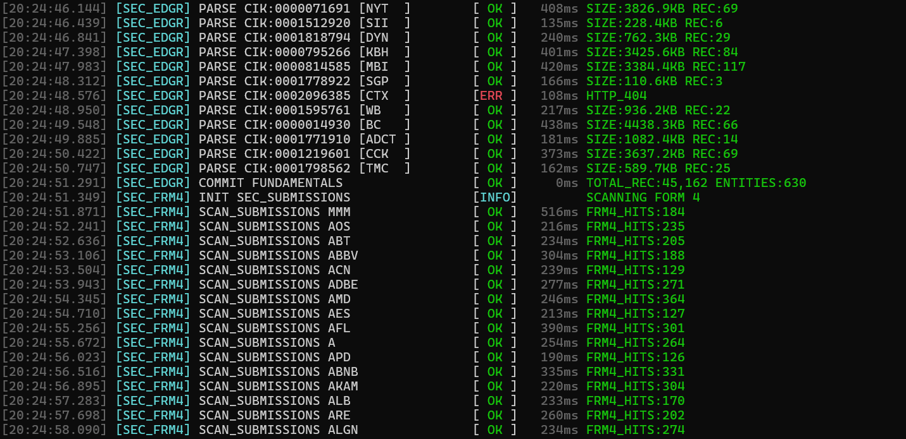
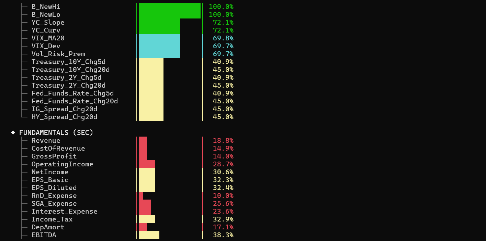

# TuKuai_sp500

## Introduction
##### 当年陈刀仔他能用20块赢到3700万,土块可以用100块赢到100万吗？

# 
# 
## 安装依赖
 
```bash
pip install yfinance pandas pyarrow requests beautifulsoup4 fredapi pandas-datareader lxml numpy html5lib
```

 
## 运行
 
### 首次运行
 
```bash
python sp500_data_pipeline.py run
```
 
程序会交互式引导你输入三个配置:
1. **FRED API Key** — 免费, 去 https://fred.stlouisfed.org/docs/api/api_key.html 注册获取
2. **SEC联系人名字** — 随意填, 如 "JohnResearch"
3. **SEC联系人邮箱** — 填你的真实Gmail
 
配置会保存到 `sp500_config.json`, 下次不用再输。

```bash
python sp500_pipeline.py run                    # 完整运行
python sp500_pipeline.py load                   # 只获取数据
python sp500_pipeline.py load --only prices     # 只重跑价格
python sp500_pipeline.py process                # 只本地计算 (无需网络)
python sp500_pipeline.py eval                   # 评估数据质量
python sp500_pipeline.py reconfig               # 重新输入API key
python sp500_pipeline.py run --clear-cache      # 清除缓存完全重跑
```

## 执行流程
 
```
run = load + process + eval

```

### Fetching Data
# 

### Evaluating Data
# 